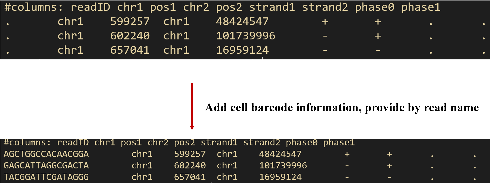

## Manual

Modified from https://github.com/lh3/hickit, add cell barcode information(extracted by readname) to .pairs file and dedup contacts by cellbarcode and position rather than position alone

```sh
hickit –i ${id}.contacts.seg.gz -o - | gzip > ${id}.contacts.pairs.gz
```



## Files changed
- hickit.h
- io.c
- pair.c

Changes are marked.
