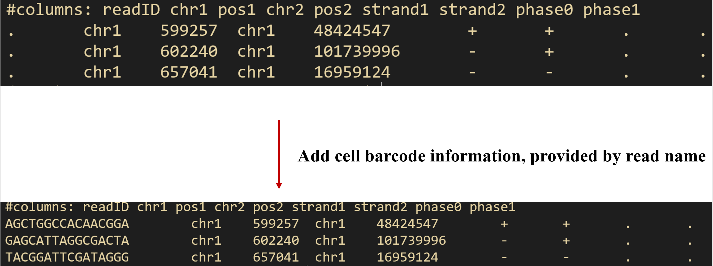

## Manual

Modified from https://github.com/lh3/hickit.
New features (for dscHiC data):
- add cell barcode information(extracted by readname) to .pairs file
- dedup contacts by cell barcode, start, end
  
```sh
hickit –i ${id}.contacts.seg.gz -o - | gzip > ${id}.contacts.pairs.gz
```



## Files changed
- hickit.h
- io.c
- pair.c

Changes are marked.
